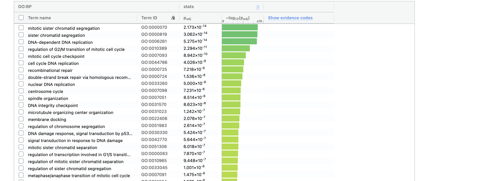
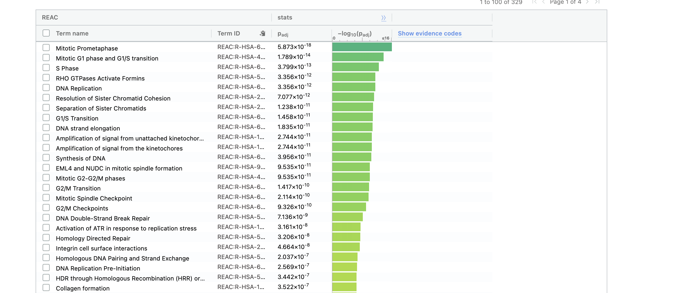
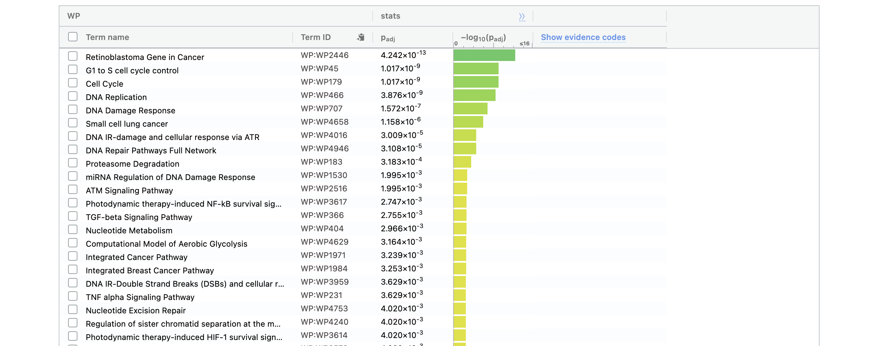
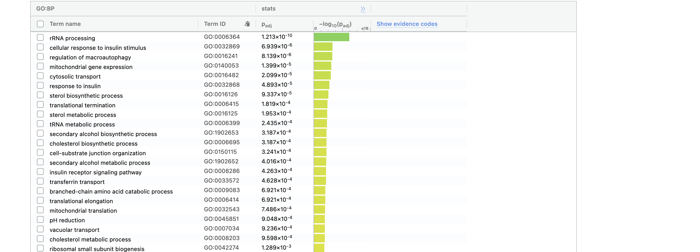
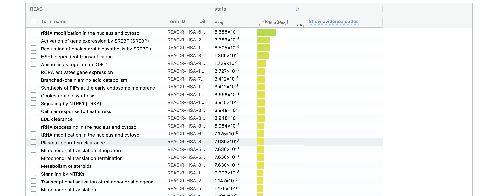
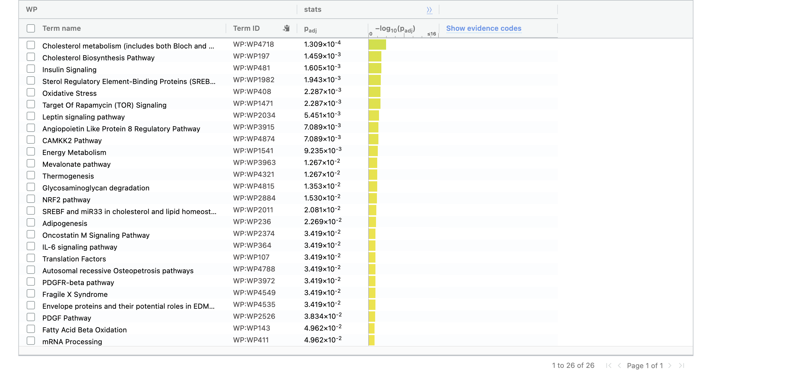
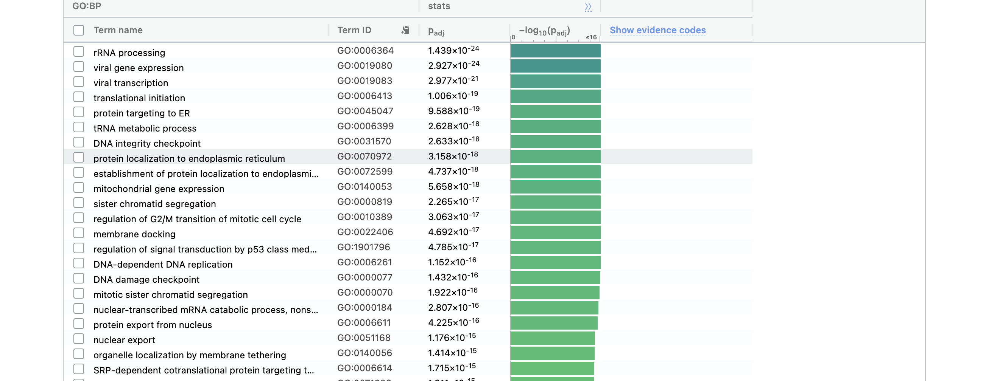
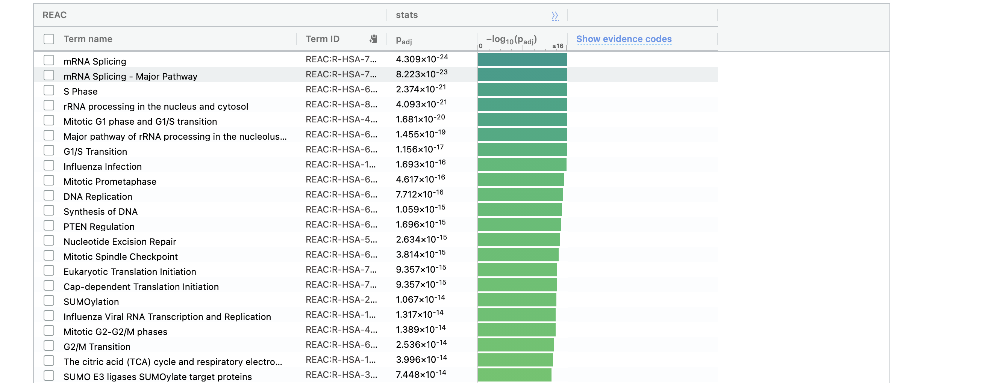
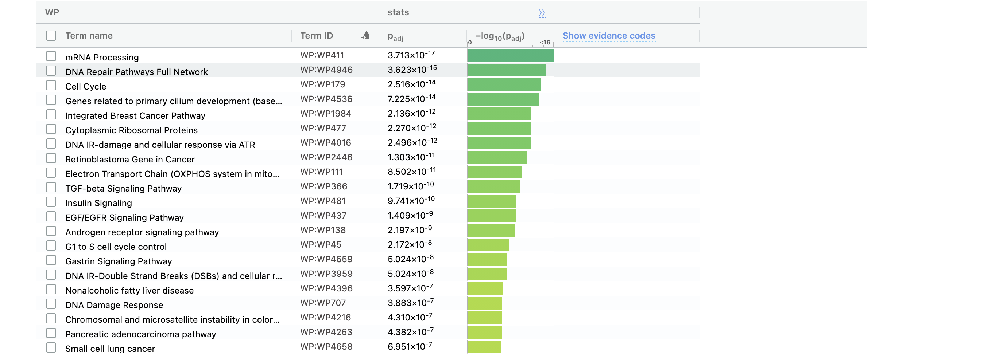

##### Note: The code used in this assignment is adopted from BCB420 Winter 2021 lectures 3 to 7.

### Setup: Install and load required libraries for the workflow.
```{r echo=TRUE, message=FALSE}
if (!requireNamespace("BiocManager", quietly = TRUE)) install.packages("BiocManager")
if (!requireNamespace("GEOmetadb", quietly = TRUE))  BiocManager::install("GEOmetadb")
if (!requireNamespace("edgeR", quietly = TRUE))     BiocManager::install("edgeR")
if (!requireNamespace("biomaRt", quietly = TRUE))  BiocManager::install("biomaRt")
if (!requireNamespace("tidyverse", quietly = TRUE)) install.packages("tidyverse")     
if (!requireNamespace("gdtools", quietly = TRUE))    install.packages("gdtools")   
if (!requireNamespace("kableExtra", quietly = TRUE))  install.packages("kableExtra")   
if (!requireNamespace("data.table", quietly = TRUE))  install.packages("data.table")   
if (!requireNamespace("ComplexHeatmap", quietly = TRUE))   BiocManager::install("ComplexHeatmap")   
                                           

library(knitr)
library(GEOmetadb)
library(edgeR)
library(biomaRt) 
library(dplyr)
library(kableExtra)
library(data.table)
library(ComplexHeatmap)
library(circlize)
```

# 1. Introduction

Study: [SARS-CoV-2 Infected Cardiomyocytes Recruit Monocytes by Secreting CCL2](https://www.ncbi.nlm.nih.gov/pmc/articles/PMC7685325/)[@sars]

GEO dataset: [GSE151879](https://www.ncbi.nlm.nih.gov/geo/query/acc.cgi?acc=GSE151879)

The aim of the sudy is to provide evidence that SARS-CoV-2 infects human cardiomyocytes.

In this report I am preforming differential gene expression analysis and preliminary over-representation analysis.

In A1, I chose my data set, downloaded it using GEOmetadb, cleaned it and normalized it.

In this section, there is a brief summary of the steps I went through from getting the data set to obtaining the normalized data.

### 1.1 Get the expression data
```{r, warning=FALSE}
sub_dir <- "GSE151879"   
p <-file.path(getwd(), sub_dir)

#if the data exists no need to download it again
if (dir.exists(p)){
  setwd(p)
  Adult_path <- "GSE151879_raw_counts_genes.Adult_human_cardiomyocytes.txt.gz"
  Macrophages_path <- "GSE151879_raw_counts_genes.Macrophages.txt.gz"
  hESC_path <- "GSE151879_raw_counts_genes.hESC-derived_cardiomyocytes.txt.gz"
  
  Adult_human_CM = read.delim(Adult_path,header=TRUE,check.names = FALSE)
  Macrophages = read.delim(Macrophages_path,header=TRUE,check.names = FALSE)
  hESC_CM = read.delim (hESC_path,header=TRUE,check.names = FALSE)
  
} else{
  
  sfiles = getGEOSuppFiles("GSE151879")
  fnames = rownames(sfiles)
  
  # there are three supplemental files, I chose to work with Adult_human_CM 
  Adult_human_CM = read.delim(fnames[1],header=TRUE,check.names = FALSE)
  Macrophages = read.delim(fnames[2],header=TRUE,check.names = FALSE)
  hESC_CM = read.delim(fnames[3],header=TRUE,check.names = FALSE)

}
```

### 1.2 Filter weakly expressed features
```{r}
#translate out counts into counts per million using the edgeR package
cpms = cpm(Adult_human_CM[,2:7])
rownames(cpms) <- Adult_human_CM[,1]
# get rid of low counts
keep = rowSums(cpms >1) >=3
Adult_human_CM_filtered = Adult_human_CM[keep,]
```

### 1.3 Define groups
```{r}
samples <- data.frame(lapply(colnames(Adult_human_CM_filtered)[2:7],      
                             FUN=function(x){unlist(strsplit(x, split = "\\_"))[c(4,5)]})) 
colnames(samples) <- colnames(Adult_human_CM_filtered)[2:7] 
rownames(samples) <- c("condition","number")
samples <- data.frame(t(samples))
```

### 1.4 Identifier Mapping
```{r}
ensembl <- useMart("ensembl")
ensembl = useDataset("hsapiens_gene_ensembl",mart=ensembl)

conversion_stash <- "Adult_human_CM_id_conversion.rds"
if (file.exists(conversion_stash)) {  
  Adult_human_CM_id_conversion<- readRDS(conversion_stash) 
} else {   
    Adult_human_CM_id_conversion <- getBM(attributes = c("ensembl_gene_id","hgnc_symbol"),                
    filters = c("ensembl_gene_id"),                             
    values = Adult_human_CM_filtered$gene_id,                  
    mart = ensembl)   
    
    saveRDS(Adult_human_CM_id_conversion, conversion_stash)
}

# merge mapped data frame with original filtered data frame
colnames(Adult_human_CM_id_conversion) <- c("gene_id", "hgnc_symbol")
data_table_1 = data.table(Adult_human_CM_filtered, key="gene_id")
data_table_2 = data.table(Adult_human_CM_id_conversion, key="gene_id")
dt.merged <- merge(data_table_1, data_table_2, all = T)
#reorder data frame
dt.merged <- dt.merged[, c(1,8,2,3,4,5,6,7)]
```

### 1.5 Normalization
```{r}
# Create our DGEList object to be used by edgeR
filtered_data_matrix <- as.matrix(dt.merged[,3:8]) 
rownames(filtered_data_matrix) <- dt.merged$gene_id
d = DGEList(counts=filtered_data_matrix, group =samples$condition )

# Calculate the normalization factors
d = calcNormFactors(d)
normalized_counts <- cpm(d)

# Merge the gene names with normalized data
normalized_count_data = data.table(normalized_counts)
normalized_count_data$gene_id <- dt.merged$gene_id
normalized_count_data$hgnc_symbol <- dt.merged$hgnc_symbol
normalized_count_data <- normalized_count_data[, c(7,8,1,2,3,4,5,6)]

# Take a look at normalized data
kable(normalized_count_data[1:5,1:8], type="html")
```

### 1.4 Inspect sample separation using MDS Plot

MDS plot represents the distances between samples. I can see a clear distinction between the two conditions.

```{r}

hold <- vector()
for (i in 1:nrow(samples)) {
  lab <-c(samples$condition[i],samples$number[i])
  hold<- c(hold, paste(lab, collapse = "_") )
}
plotMDS(d, labels= hold, 
        col = c("darkgreen","blue")[factor(samples$condition)], main = "MDS Plot") 
```

# 2. Differential expression

### 2.1 Create model
```{r}
# Use SARS-CoV2 condition for model
model_design <- model.matrix(~samples$condition)
```

### 2.2 Estimate and view dispersion
```{r}
d <- estimateDisp(d, model_design)
plotBCV(d,col.tagwise = "black",col.common = "red", main = "BCV Plot")
plotMeanVar(d, show.raw.vars = TRUE, show.tagwise.vars=TRUE,      
            show.ave.raw.vars = TRUE,     
            NBline=TRUE,      
            show.binned.common.disp.vars = TRUE, main = "Mean-Variance Plot")
```

```{r,echo=FALSE, eval = FALSE, include=FALSE}
# 2.1

# 2.2 kable(topTags(qlf.pos_vs_neg), type="html",row.names = FALSE)

#2.3
#with(qlf.pos_vs_neg$table, plot(logCPM,logFC))
#plotMD(qlf.pos_vs_neg, pch = 16, cex = 0.5)

# heat map before DE analysis
heatmap_matrix <- normalized_count_data[, 3:ncol(normalized_count_data)]
rownames(heatmap_matrix) <- normalized_count_data$gene_id 
colnames(heatmap_matrix) <- colnames(normalized_count_data[,3:ncol(normalized_count_data)])


heatmap_matrix <- t(scale(t(heatmap_matrix)))

if(min(heatmap_matrix) == 0){    
  heatmap_col = colorRamp2(c( 0, max(heatmap_matrix)),  
                           c( "white", "red"))  
} else {   
    heatmap_col = colorRamp2(c(min(heatmap_matrix), 0,       
                               max(heatmap_matrix)), c("blue", "white", "red"))  
    }
current_heatmap <- Heatmap(as.matrix(heatmap_matrix),    
                           show_row_dend = TRUE,
                           show_column_dend = TRUE,     
                           col=heatmap_col,
                           show_column_names = TRUE,      
                           show_row_names = FALSE,
                           show_heatmap_legend = TRUE)

current_heatmap
```

### 2.3 Calculate differential expression using the Quasi liklihood model
```{r}
# fit the model
fit <- glmQLFit(d, model_design)
#calculate differential expression 
qlf.pos_vs_neg <- glmQLFTest(fit, coef='samples$conditionSARS-CoV2') 

qlf_output_hits <- topTags(qlf.pos_vs_neg,sort.by = "PValue",                   
                           n = nrow(normalized_count_data))

kable(topTags(qlf.pos_vs_neg), type="html",row.names = FALSE, digits = 32)

# number of genes passed the threshold p-value < 0.05
length(which(qlf_output_hits$table$PValue < 0.05))

# number of genes passed correction
length(which(qlf_output_hits$table$FDR < 0.05))
```

### 2.4 Volcano Plot

The volcano plot shows the significantly differentially expressed genes in red.

```{r}
# code adopted from http://www.nathalievialaneix.eu/doc/html/solution_edgeR-tomato.html#volcano-plot
volcanoData <- cbind(qlf_output_hits$table$logFC, -log10(qlf_output_hits$table$FDR))
colnames(volcanoData) <- c("logFC", "negLogPval")
DEGs <- qlf_output_hits$table$FDR < 0.05 & abs(qlf_output_hits$table$logFC) > 1
point.col <- ifelse(DEGs, "red", "black")
plot(volcanoData, pch = 16, col = point.col, cex = 0.5, main = "Volcano Plot")
```

#### 2.5  Heatmap of top hits using the Quasi liklihood model (p-value < 0.05)
```{r}
# make column name shorter for better heat map visibility, "CM" stands for Cardiomyocytes
normalized_count_data_colnameChange <- normalized_count_data
colnames(normalized_count_data_colnameChange)[3] <- "CM_Mock_1"
colnames(normalized_count_data_colnameChange)[4] <- "CM_Mock_2"
colnames(normalized_count_data_colnameChange)[5] <- "CM_Mock_3"
colnames(normalized_count_data_colnameChange)[6] <- "CM_SARS-CoV2_1"
colnames(normalized_count_data_colnameChange)[7] <- "CM_SARS-CoV2_2"
colnames(normalized_count_data_colnameChange)[8] <- "CM_SARS-CoV2_3"
heatmap_matrix <- normalized_count_data_colnameChange[, 3:ncol(normalized_count_data_colnameChange)]
rownames(heatmap_matrix) <- normalized_count_data_colnameChange$gene_id 
colnames(heatmap_matrix) <- colnames(normalized_count_data_colnameChange[,3:ncol(normalized_count_data_colnameChange)])

top_hits <- rownames(qlf_output_hits$table)[qlf_output_hits$table$PValue               
                                            <0.05] 
heatmap_matrix_tophits <- t(scale(t(heatmap_matrix[which(rownames(heatmap_matrix) %in% top_hits),])))

if(min(heatmap_matrix_tophits) == 0){   
  heatmap_col = colorRamp2(c( 0, max(heatmap_matrix_tophits)),      
                           c( "white", "red"))  
  } else {   
           heatmap_col = colorRamp2(c(min(heatmap_matrix_tophits), 
                                                        0,  max(heatmap_matrix_tophits)), 
                                                      c("blue", "white", "red"))  
                             }
current_heatmap <- Heatmap(as.matrix(heatmap_matrix_tophits),   
                           show_row_dend = TRUE,                 
                           show_column_dend = TRUE,              
                           col=heatmap_col,                       
                           show_column_names = TRUE,              
                           show_row_names = FALSE,                   
                           show_heatmap_legend = TRUE,               
                           )
```

```{r}
# Show heat map
current_heatmap
```

### 2.6 Answers to questions

- Calculate p-values for each of the genes in your expression set. How many genes were significantly differentially expressed? What thresholds did you use and why?

See section 2.3. 7617 genes passed the p-value threshold of < 0.05 so they are significantly differentially expressed . I used 0.05 threshold as it is widely accepted cutoff for significance.

- Multiple hypothesis testing - correct your p-values using a multiple hypothesis correction method. Which method did you use? And Why? How many genes passed correction?

I used Benjamni-Hochberg correction for multiple hypothesis testing because it is not as stringent as the Bonferroni correction and also it is used in the edgeR package. 6890 genes passed correction.

- Show the amount of differentially expressed genes using an MA Plot or a Volcano plot. Highlight genes of interest.

See section 2.4.

- Visualize your top hits using a heatmap. Do you conditions cluster together? Explain why or why not.

See section 2.5. Yes, they do cluster together due to similarity.


# 3. Thresholded over-representation analysis

### 3.1 Create thresholded lists of genes

```{r}
# merge output hits with gene names
qlf_output_hits_withg = as.data.frame(qlf_output_hits)
qlf_output_hits_withg <- data.frame(names = row.names(qlf_output_hits_withg), qlf_output_hits_withg)
rownames(qlf_output_hits_withg ) <- c()
colnames(qlf_output_hits_withg)[1] <- "gene_id"
qlf_output_hits_withgn <- merge(dt.merged[,1:2],qlf_output_hits_withg)
qlf_output_hits_withgn <-qlf_output_hits_withgn[order(qlf_output_hits_withgn$PValue),]

# add rank column
qlf_output_hits_withgn[,"rank"] <- -log(qlf_output_hits_withgn$PValue, base = 10) * sign(qlf_output_hits_withgn$logFC)
qlf_output_hits_withgn <- qlf_output_hits_withgn[order(qlf_output_hits_withgn$rank),]

# P.S gaps exist in the file where there are no hgnc_symbols (NA) because they were not mapped.
upregulated_genes <- qlf_output_hits_withgn$hgnc_symbol[   
  which(qlf_output_hits_withgn$PValue < 0.05      
        & qlf_output_hits_withgn$logFC > 0)] 

downregulated_genes <- qlf_output_hits_withgn$hgnc_symbol[  
  which(qlf_output_hits_withgn$PValue < 0.05             
        & qlf_output_hits_withgn$logFC < 0)]


write.table(x=upregulated_genes,          
            file=file.path("./","upregulated_genes.txt"),sep ="\t",
            row.names = FALSE,col.names = FALSE,quote = FALSE)

write.table(x=downregulated_genes,          
            file=file.path("./","downregulated_genes.txt"),sep ="\t",
            row.names = FALSE,col.names = FALSE,quote = FALSE)

write.table(x=data.frame(genename= qlf_output_hits_withgn$hgnc_symbol, F_stat = qlf_output_hits_withgn$rank),          
            file=file.path("./","ranked_genelist.txt"),sep ="\t",
            row.names = FALSE,col.names = FALSE,quote = FALSE)
```

### 3.2 Over-representation Analysis

I used g:Profiler web server to perform the gene list enrichment analysis.

I ran g:Profiler 3 times: one for each list respectively (upregulated_genes, downregulated_genes, ranked_genelist)

**Options configuration:**

**Advanced options:**

No evidence codes

Significance threshold: Benjamini-Hochberg FDR

User threshold: 0.05

**Data sources:**

GO biological process

No electronic GO annotations 

Reactome

WikiPathways

After query, term size was restricted to 200 genes.

###  3.3 g:Profiler Results

#### 3.3.1 Upregulated genes





#### 3.3.2 Downregulated genes





#### 3.3.1 All genes






### 3.4 Answers to questions:
- Which method did you choose and why?

I used g:Profiler because I am working with thresholded lists.

- What annotation data did you use and why? What version of the annotation are you using?

 GO biological process release 2021-02-01.
 
 Reactome version 75.
 
 Wikipathways version 20210310

- How many genesets were returned with what thresholds?

All queries are with 0.05 threshold and maximum term size of 200.

**Upregulted genes:**

Go results: 329 genesets.

Reactome results: 198 genesets 

Wikipathways results: 63 genesets 

**Downregulted genes:**

Go results: 37 genesets 

Reactome results: 43 genesets 

Wikipathways results: 26 genesets 


**All genes:**

Go results: 1032 genesets

Reactome results: 581 genesets 

Wikipathways results: 184 genesets 

- Run the analysis using the up-regulated set of genes, and the down-regulated set of genes separately. How do these results compare to using the whole list (i.e all differentially expressed genes together vs. the up-regulated and down regulated differentially expressed genes separately)?

The results for all genes had a mix of genesets from both upregulated genes and downregulated genes results.


# 4. Interpretation

- Do the over-representation results support conclusions or mechanism discussed in the original paper?

The [main paper](https://www.ncbi.nlm.nih.gov/pmc/articles/PMC7685325/)[@sars] mentions that SARS-CoV2 infected cells show downregulation of functional cardiomyocytes associated genes and upregulation of ROS related genes. They only gave a few genes as an example of both. My results show that the upregulated genes are mostly in DNA replication processes. According to this [ paper](https://www.annualreviews.org/doi/full/10.1146/annurev-cancerbio-041916-065808)[@ros] , as ROS level increases in cells, cell profileration increases up to a point then cell death occurs. This is consistent with the main paper and my results as ROS related genes are upregulated causing cell death when ROS reaches a high level. On the otherhand, my results show that the downregulated genes are mostly in metbalic processes like rRNA processing and cholestrol biosynthesis. This is consistent with the paper's results as downregulation of genes associated with metabolism causes cell death. So overall, SARS-CoV2 infected cells are more susceptible to cell death. 

- Can you find evidence, i.e. publications, to support some of the results that you see. How does this evidence support your results.

Yes, this [paper](https://www.ncbi.nlm.nih.gov/pmc/articles/PMC7543363/)[@sars2] also shows that SARS-CoV-2 infects and induces cytotoxic effects in human cardiomyocytes.


# 5. References

- All R packages used can be found in the Setup section.

 

