##### Note: The code used in this assignment is adopted from BCB420 Winter 2021 lectures 3 to 12.

### Setup: Install and load required libraries for the workflow.
```{r echo=TRUE, message=FALSE}
if (!requireNamespace("BiocManager", quietly = TRUE)) install.packages("BiocManager")
if (!requireNamespace("GEOmetadb", quietly = TRUE))  BiocManager::install("GEOmetadb")
if (!requireNamespace("edgeR", quietly = TRUE))     BiocManager::install("edgeR")
if (!requireNamespace("biomaRt", quietly = TRUE))  BiocManager::install("biomaRt")
if (!requireNamespace("tidyverse", quietly = TRUE)) install.packages("tidyverse")     
if (!requireNamespace("gdtools", quietly = TRUE))    install.packages("gdtools")   
if (!requireNamespace("kableExtra", quietly = TRUE))  install.packages("kableExtra")   
if (!requireNamespace("data.table", quietly = TRUE))  install.packages("data.table")   
tryCatch(expr = { library("RCurl")}, 
         error = function(e) {  install.packages("RCurl")}, 
         finally = library("RCurl"))

library(knitr)
library(GEOmetadb)
library(edgeR)
library(biomaRt) 
library(dplyr)
library(kableExtra)
library(data.table)
```

# 1. Introduction

Study: [SARS-CoV-2 Infected Cardiomyocytes Recruit Monocytes by Secreting CCL2](https://www.ncbi.nlm.nih.gov/pmc/articles/PMC7685325/)[@sars]

GEO dataset: [GSE151879](https://www.ncbi.nlm.nih.gov/geo/query/acc.cgi?acc=GSE151879)

The aim of the study is to provide evidence that SARS-CoV-2 infects human cardiomyocytes.

In this repor, i will take the ranked data that was created in Assignment #2 and perform non-thresholded pathway analysis. Then I will summarize and visualize the results using Cytoscape and the Enrichment map pipeline.

In Assignment #1, I chose my data set, downloaded it using GEOmetadb, cleaned it and normalized it.

In Assignment #2, I preformed differential gene expression analysis and preliminary over-representation analysis.

In this section, there is a brief summary of the steps I went through from getting the data set to obtaining the normalized data and calculating the differential expression.

### 1.1.1 Get the expression data
```{r, warning=FALSE}
sub_dir <- "GSE151879"   
p <-file.path(getwd(), sub_dir)

#if the data exists no need to download it again
if (dir.exists(p)){
  setwd(p)
  Adult_path <- "GSE151879_raw_counts_genes.Adult_human_cardiomyocytes.txt.gz"
  Macrophages_path <- "GSE151879_raw_counts_genes.Macrophages.txt.gz"
  hESC_path <- "GSE151879_raw_counts_genes.hESC-derived_cardiomyocytes.txt.gz"
  
  Adult_human_CM = read.delim(Adult_path,header=TRUE,check.names = FALSE)
  Macrophages = read.delim(Macrophages_path,header=TRUE,check.names = FALSE)
  hESC_CM = read.delim (hESC_path,header=TRUE,check.names = FALSE)
  
} else{
  
  sfiles = getGEOSuppFiles("GSE151879")
  fnames = rownames(sfiles)
  
  # there are three supplemental files, I chose to work with Adult_human_CM 
  Adult_human_CM = read.delim(fnames[1],header=TRUE,check.names = FALSE)
  Macrophages = read.delim(fnames[2],header=TRUE,check.names = FALSE)
  hESC_CM = read.delim(fnames[3],header=TRUE,check.names = FALSE)

}
```

### 1.1.2 Filter weakly expressed features
```{r}
#translate out counts into counts per million using the edgeR package
cpms = cpm(Adult_human_CM[,2:7])
rownames(cpms) <- Adult_human_CM[,1]
# get rid of low counts
keep = rowSums(cpms >1) >=3
Adult_human_CM_filtered = Adult_human_CM[keep,]
```

### 1.1.3 Define groups
```{r}
samples <- data.frame(lapply(colnames(Adult_human_CM_filtered)[2:7],      
                             FUN=function(x){unlist(strsplit(x, split = "\\_"))[c(4,5)]})) 
colnames(samples) <- colnames(Adult_human_CM_filtered)[2:7] 
rownames(samples) <- c("condition","number")
samples <- data.frame(t(samples))
```

### 1.1.4 Identifier Mapping
```{r}
ensembl <- useMart("ensembl")
ensembl = useDataset("hsapiens_gene_ensembl",mart=ensembl)

conversion_stash <- "Adult_human_CM_id_conversion.rds"
if (file.exists(conversion_stash)) {  
  Adult_human_CM_id_conversion<- readRDS(conversion_stash) 
} else {   
    Adult_human_CM_id_conversion <- getBM(attributes = c("ensembl_gene_id","hgnc_symbol"),                
    filters = c("ensembl_gene_id"),                             
    values = Adult_human_CM_filtered$gene_id,                  
    mart = ensembl)   
    
    saveRDS(Adult_human_CM_id_conversion, conversion_stash)
}

# merge mapped data frame with original filtered data frame
colnames(Adult_human_CM_id_conversion) <- c("gene_id", "hgnc_symbol")
data_table_1 = data.table(Adult_human_CM_filtered, key="gene_id")
data_table_2 = data.table(Adult_human_CM_id_conversion, key="gene_id")
dt.merged <- merge(data_table_1, data_table_2, all = T)
#reorder data frame
dt.merged <- dt.merged[, c(1,8,2,3,4,5,6,7)]
```

### 1.1.5 Normalization
```{r}
# Create our DGEList object to be used by edgeR
filtered_data_matrix <- as.matrix(dt.merged[,3:8]) 
rownames(filtered_data_matrix) <- dt.merged$gene_id
d = DGEList(counts=filtered_data_matrix, group =samples$condition )

# Calculate the normalization factors
d = calcNormFactors(d)
normalized_counts <- cpm(d)

# Merge the gene names with normalized data
normalized_count_data = data.table(normalized_counts)
normalized_count_data$gene_id <- dt.merged$gene_id
normalized_count_data$hgnc_symbol <- dt.merged$hgnc_symbol
normalized_count_data <- normalized_count_data[, c(7,8,1,2,3,4,5,6)]

# Take a look at normalized data
kable(normalized_count_data[1:5,1:8], type="html")
```
### 1.2 Differential expression

### 1.2.1 Create model
```{r}
# Use SARS-CoV2 condition for model
model_design <- model.matrix(~samples$condition)
```

### 1.2.2 Estimate dispersion
```{r}
d <- estimateDisp(d, model_design)
```
### 1.2.3 Calculate differential expression using the Quasi likelihood model
```{r}
# fit the model
fit <- glmQLFit(d, model_design)
#calculate differential expression 
qlf.pos_vs_neg <- glmQLFTest(fit, coef='samples$conditionSARS-CoV2') 

qlf_output_hits <- topTags(qlf.pos_vs_neg,sort.by = "PValue",                   
                           n = nrow(normalized_count_data))

kable(topTags(qlf.pos_vs_neg), type="html",row.names = FALSE, digits = 32)

# number of genes passed the threshold p-value < 0.05
length(which(qlf_output_hits$table$PValue < 0.05))

# number of genes passed correction
length(which(qlf_output_hits$table$FDR < 0.05))
```

### 1.2.4 Create thresholded lists of genes

```{r}
# merge output hits with gene names
qlf_output_hits_withg = as.data.frame(qlf_output_hits)
qlf_output_hits_withg <- data.frame(names = row.names(qlf_output_hits_withg), qlf_output_hits_withg)
rownames(qlf_output_hits_withg ) <- c()
colnames(qlf_output_hits_withg)[1] <- "gene_id"
qlf_output_hits_withgn <- merge(dt.merged[,1:2],qlf_output_hits_withg)
qlf_output_hits_withgn <-qlf_output_hits_withgn[order(qlf_output_hits_withgn$PValue),]

# add rank column
qlf_output_hits_withgn[,"rank"] <- -log(qlf_output_hits_withgn$PValue, base = 10) * sign(qlf_output_hits_withgn$logFC)
qlf_output_hits_withgn <- qlf_output_hits_withgn[order(qlf_output_hits_withgn$rank),]

# P.S gaps exist in the file where there are no hgnc_symbols (NA) because they were not mapped.
upregulated_genes <- qlf_output_hits_withgn$hgnc_symbol[   
  which(qlf_output_hits_withgn$PValue < 0.05      
        & qlf_output_hits_withgn$logFC > 0)] 

downregulated_genes <- qlf_output_hits_withgn$hgnc_symbol[  
  which(qlf_output_hits_withgn$PValue < 0.05             
        & qlf_output_hits_withgn$logFC < 0)]


write.table(x=upregulated_genes,          
            file=file.path("./","upregulated_genes.txt"),sep ="\t",
            row.names = FALSE,col.names = FALSE,quote = FALSE)

write.table(x=downregulated_genes,          
            file=file.path("./","downregulated_genes.txt"),sep ="\t",
            row.names = FALSE,col.names = FALSE,quote = FALSE)

# Need to filter empty values for GSEA to work.
# Filter 372 rows out
qlf_output_hits_withgn_Filtered <- qlf_output_hits_withgn[!(!is.na(qlf_output_hits_withgn$hgnc_symbol) & qlf_output_hits_withgn$hgnc_symbol==""), ] 

write.table(x=data.frame(genename= qlf_output_hits_withgn_Filtered$hgnc_symbol, F_stat = qlf_output_hits_withgn_Filtered$rank),   
            file=file.path("./","ranked_genelist_filtered.txt"),sep ="\t",
            row.names = FALSE,col.names = TRUE,quote = FALSE)
```

# 2. Non-thresholded Gene set Enrichment Analysis

I downloaded the Bader lab genesets using the following code
```{r}
gmt_url <- "http://download.baderlab.org/EM_Genesets/current_release/Human/symbol/"

filenames <- getURL(gmt_url)
tc <- textConnection(filenames)
contents <- readLines(tc)
close(tc)

rx <- gregexpr("(?<=<a href=\")(.*.GOBP_AllPathways_no_GO_iea.*.)(.gmt)(?=\">)", contents, perl = TRUE)
gmt_file <- unlist(regmatches(contents, rx))
download.file(paste(gmt_url, gmt_file, sep = ""), "gmt_file.gmt")

```


- What method did you use? What genesets did you use? Make sure to specify versions and cite your methods.

I used [GSEA](https://www.gsea-msigdb.org/gsea/index.jsp)[@subramanian2005gene] v4.1.0 desktop application to conduct my analysis.

I used the Run GSEA Preranked method.   

I used the current release of the Bader lab [genesets](http://download.baderlab.org/EM_Genesets/current_release/Human/symbol/)   which are compiled from multiple resources like Gene Ontology, Reactome, Wikipathways. The genesets I used exclude GO annotations inferred from electronic annotaions.

Specifically the file name: "Human_GOBP_AllPathways_no_GO_iea_March_01_2021_symbol.gmt".  
     
- Summarize your enrichment results.

I used the "gmt_file.gmt" as my genesets file and "ranked_genelist_filteredGSEA.rnk" as my ranked list file.  

Parameters: permutations:1000, max size: 200, min size: 15, no collapse.

**Results**

**GSEA Summary:**
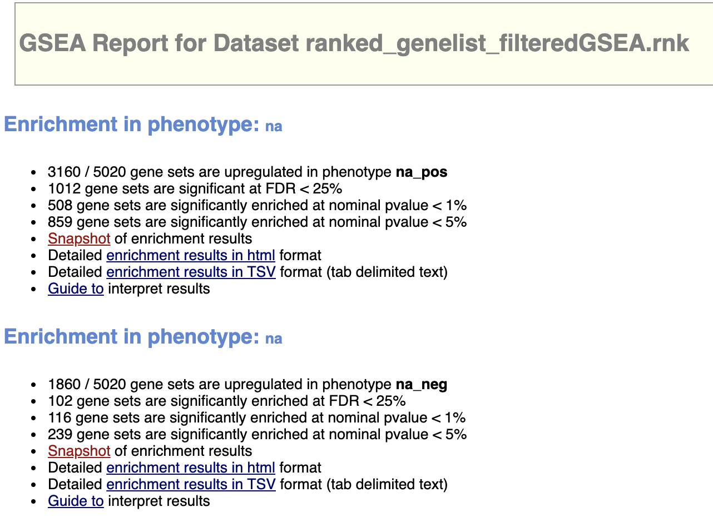


**Upregulated:**
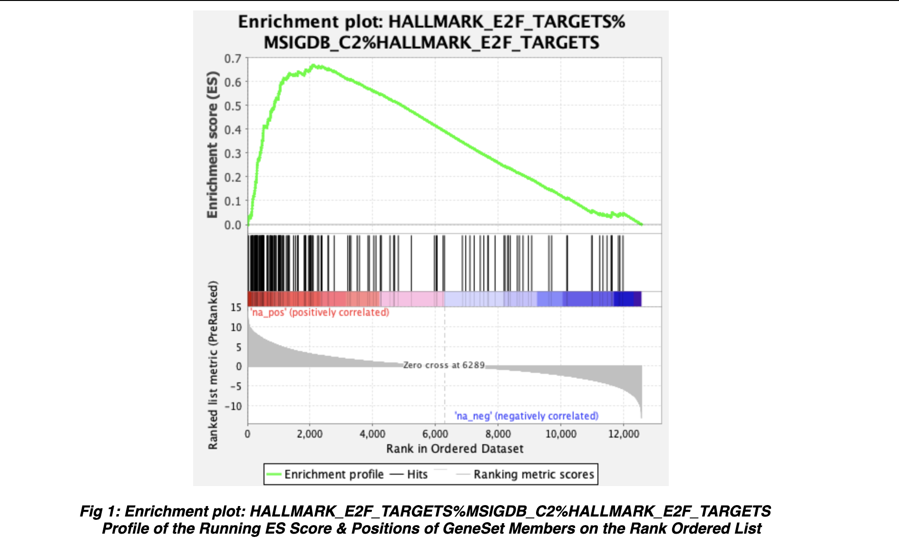


Top Geneset for upregulated genes in SARS-CoV2 infected cells: HALLMARK_E2F_TARGETS%MSIGDB_C2%HALLMARK_E2F_TARGETS

- P-value: 0
- Enrichment Score (ES): 0.66903824
- Normalized Enrichment Score (NES): 2.5968783
- FDR: 0
- Number of genes in leading-edge: 88
- Top gene: RRM2 [UniProt](https://www.uniprot.org/uniprot/P31350)


**Downregulated:**
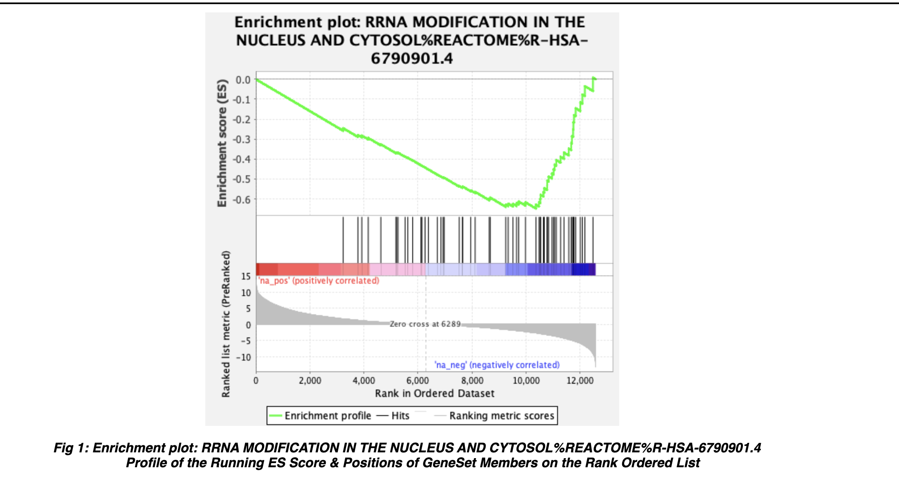

Top Geneset for downregulated genes in SARS-CoV2 infected cells: RRNA MODIFICATION IN THE NUCLEUS AND CYTOSOL%REACTOME%R-HSA-6790901.4

- P-value: 0
- Enrichment Score (ES): -0.6478056
- Normalized Enrichment Score (NES): -2.3285239
- FDR: 0
- Number of genes in leading-edge: 26
- Top gene: WDR3 [UniProt](https://www.uniprot.org/uniprot/Q9UNX4)

- How do these results compare to the results from the thresholded analysis in Assignment #2?

The results from GSEA convey the same message as my results in A2. In the upregulated genes, the top gene in the top geneset is RRM2. Accordng to [UniProt](https://www.uniprot.org/uniprot/P31350),RRM2 is necessary in DNA synthesis. I also explored some of the other top genes and they all serve a function in DNA synthesis or replication. This is similar to my result in A2 where the upregulated genes are in genesets related to DNA replication.In the downregulated genes, the top gene in the top geneset is WDR3. According to [UniProt](https://www.uniprot.org/uniprot/Q9UNX4),WDR3 is invloved in rRNA processing. I also explored some of the other top genes and they all serve a function in rRNA processing and modification. rRNA processing is related to translation of proteins and metabolic processes. This is similar to my result in A2 where the downregulated genes are in genesets related to rRNA processing and metabolism.  

# 3.Cytoscape

I followed the steps in this [paper](https://www.nature.com/articles/s41596-018-0103-9)(@reimand2019pathway) generate the enrichment map and explore it.


### 3.1 Enrichment Map

I generated the Enrichment Map using the [EnrichmentMap](http://apps.cytoscape.org/apps/enrichmentmap) application from Cytoscape.

I tried FDR q value cutoffs and I found that 0.05 balances the number of nodes well with the pathways shown. For reference, 0.1 FDR cutoff resulted in too many nodes and the recommended 0.01 cut off showed only one node for downregulated pathways.

Number of nodes: 405, Number of edges: 2162

Thresholds:

- P-value: 1.0 
- FDR Q-value: 0.05 
- Jaccard Overlap Combined: 0.375  Test used: Jaccard Overlap Combined Index (k constant = 0.5) 
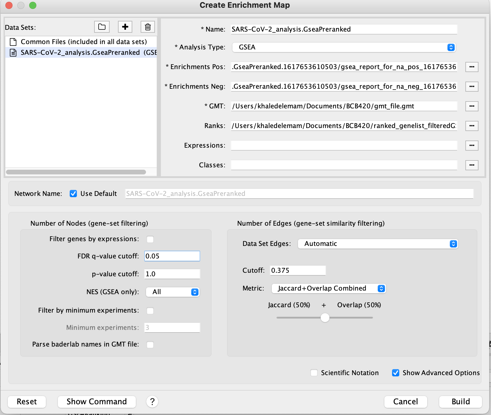


**Enrichment Map** prior to manual layout:


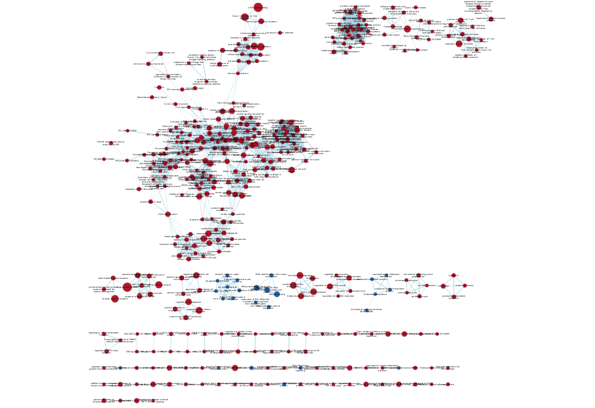


### 3.2 Network Annotation / Major biological themes 

I used AutoAnnotate Cytoscape application which is part of the [EnrichmentMap Pipeline Collection](http://apps.cytoscape.org/apps/enrichmentmappipelinecollection) I installed from Cytoscape.

Here is the **annotation map** generated:

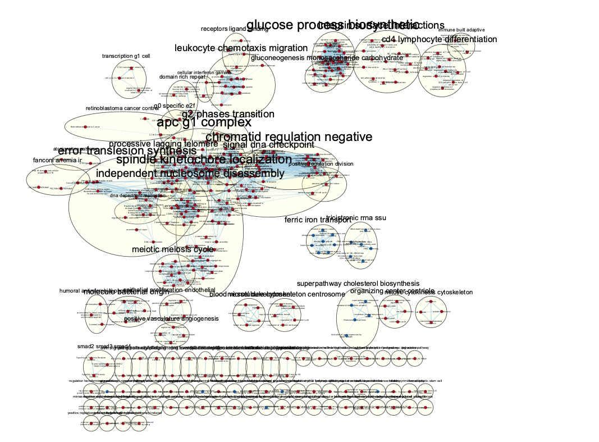

Each cluster in the network has a circle annotation drawn around it and is associated with labels that correspond to the most frequent node labels in the cluster.

The network is very dense and not easy to see the important pathways so I decided to select top pathways and create a subnetwork for better visualization. I used the Column Filter feature with the following parameters:

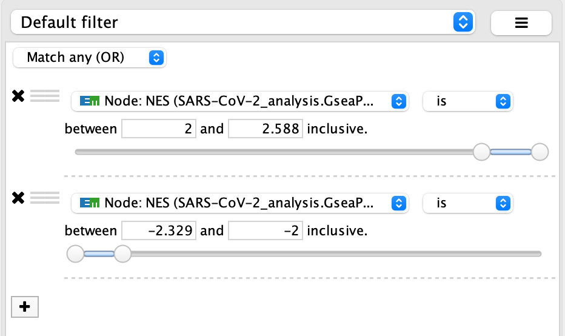
This filter selects the top 105 nodes and use them to construct another network. Here is the **annotated network** after the filter:


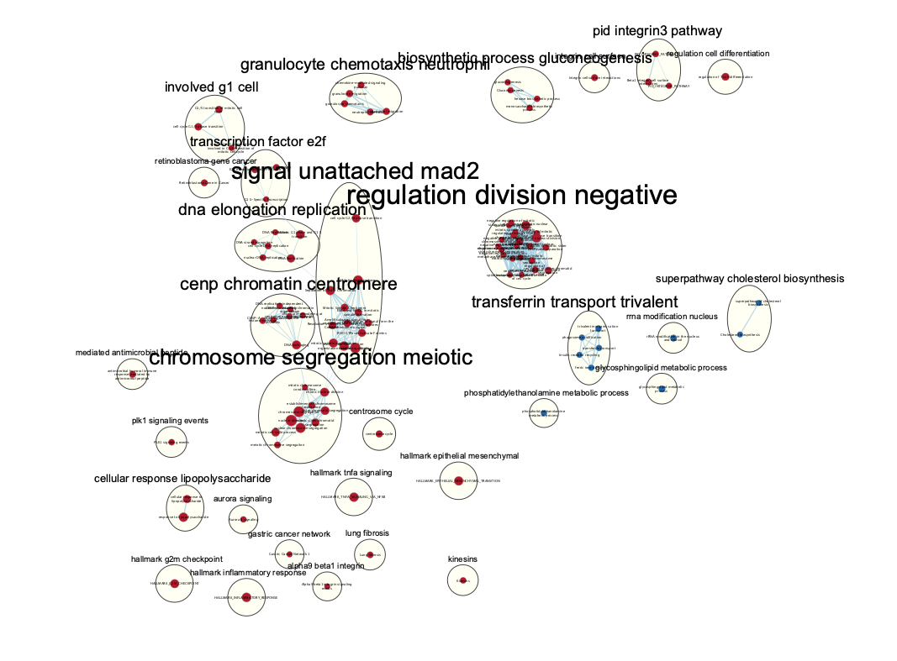 

**Legend: **
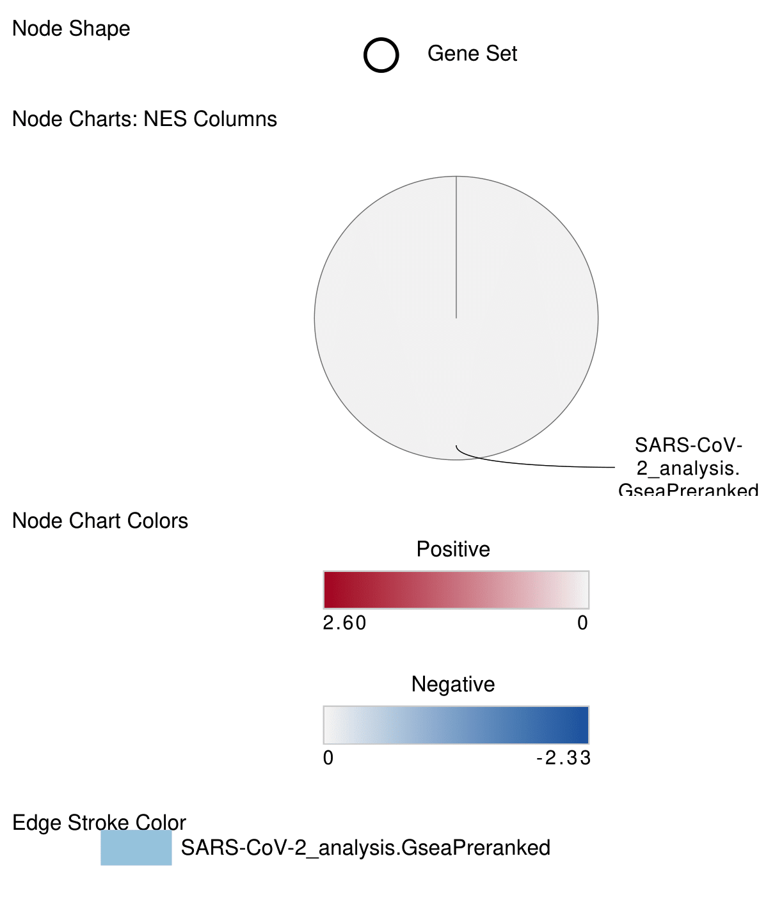

**Expanded Legend:**

**Node:** *Shape:* circles correspond to gene sets, *Size*: the size of each circle corresponds to the gene set size, *Color:* Red: upregulated genes. Blue: downregulated genes.

**Edge:** *Size:* the thickness of each edge corresponds to the overlap size, *Color:* light blue edges correspond to gene overlap.

Now the network is much clearer and I can see the top pathways associated with my genes.

### 3.3 Simplified network view

I used "Collapse All" feature in the AutoAnnotate app to create a single group node for each cluster with a summarized label.

Here is the **collapsed network:**

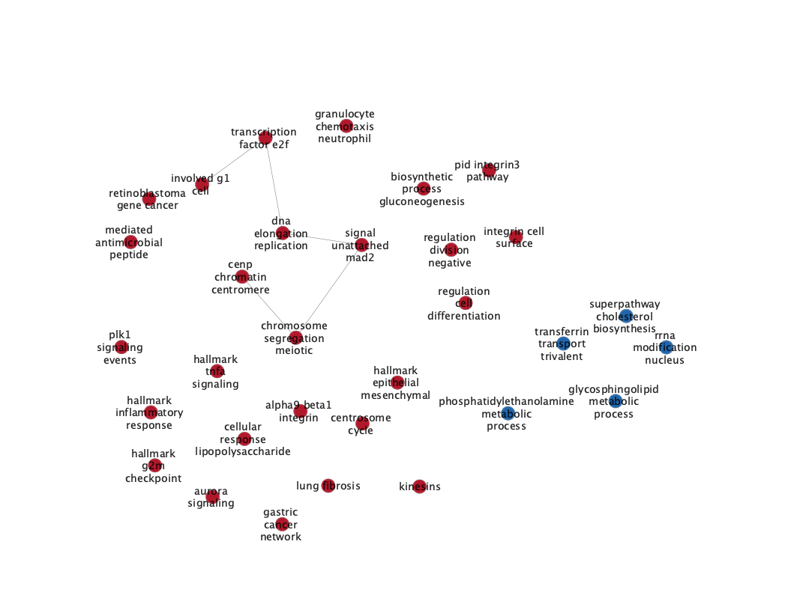

The major theme in the upregulated genes is of DNA replicaton and in the downregulated genes is of metabolism and biosynthesis. These themes match my results from GSEA (see section #2). A novel theme that was not quite obvious in GSEA analysis is the pathways related to inflammatory response and cancer network in the upregulated genes.


# 4.Interpretation and detailed view of results

### 4.1 Interpretation

- Do the enrichment results support conclusions or mechanism discussed in the original paper? How do these results differ from the results you got from Assignment #2 thresholded methods?

The [main paper](https://www.ncbi.nlm.nih.gov/pmc/articles/PMC7685325/)[@sars] mentions that SARS-CoV2 infected cells show downregulation of functional cardiomyocytes associated genes and upregulation of ROS related genes. They only gave a few genes as an example of both. My results show that the upregulated genes are mostly in DNA replication processes. According to this [paper](https://www.annualreviews.org/doi/full/10.1146/annurev-cancerbio-041916-065808)[@ros] , as ROS level increases in cells, cell profileration increases up to a point then cell death occurs. This is consistent with the main paper and my results as ROS related genes are upregulated causing cell death when ROS reaches a high level. On the other hand, my results show that the downregulated genes are mostly in metabolic processes like rRNA processing and cholestrol biosynthesis. This is consistent with the paper's results as downregulation of genes associated with metabolism causes cell death. So overall, SARS-CoV2 infected cells are more susceptible to cell death. 

The main difference between the enrichment results and the results in Assignment #2 is that the enrichment map provides a more clear picture of the pathways the genes are associated with. As mentioned is section #3.3, a novel theme that was not clear in thresholded analysis is the the pathways related to inflammatory response and cancer network in the upregulated genes. These pathways are an indicator that the SARS-COV2 infected cells are under stress that can lead to cell death. This further supports the conclusion that SARS-COV2 infected cells are more are more susceptible to cell death. 


- Can you find evidence, i.e. publications, to support some of the results that you see. How does this evidence support your result?

Yes, this [paper](https://www.ncbi.nlm.nih.gov/pmc/articles/PMC7543363/)[@sars2] also shows that SARS-CoV-2 infects and induces cytotoxic effects in human cardiomyocytes.

### 4.2 Post-Analysis

I chose the retinoblastoma gene in cancer pathway to investigate because I am interested to see how it affects the SARS-COV2 infected cells that I am studying. WikiPathways id: WP2446

I found this [tutorial](https://cytoscape.org/cytoscape-tutorials/protocols/wikipathways-app/#/2) helpful for importing and annotating WikiPathways.

**Annotated pathway with rank file that I used for GSEA analysis:**

**Part 1**
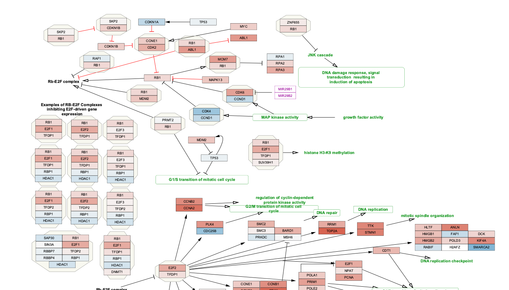
**Part 2**
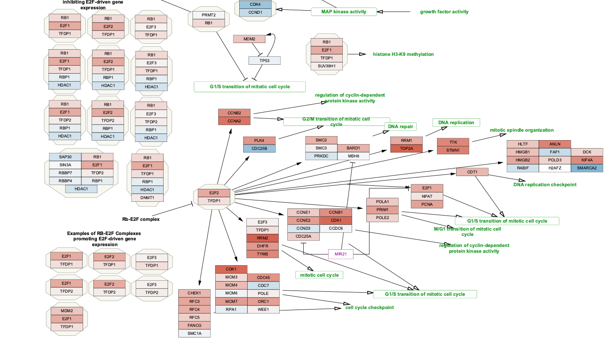


# 5. References

- All R packages used can be found in the Setup section.

 

